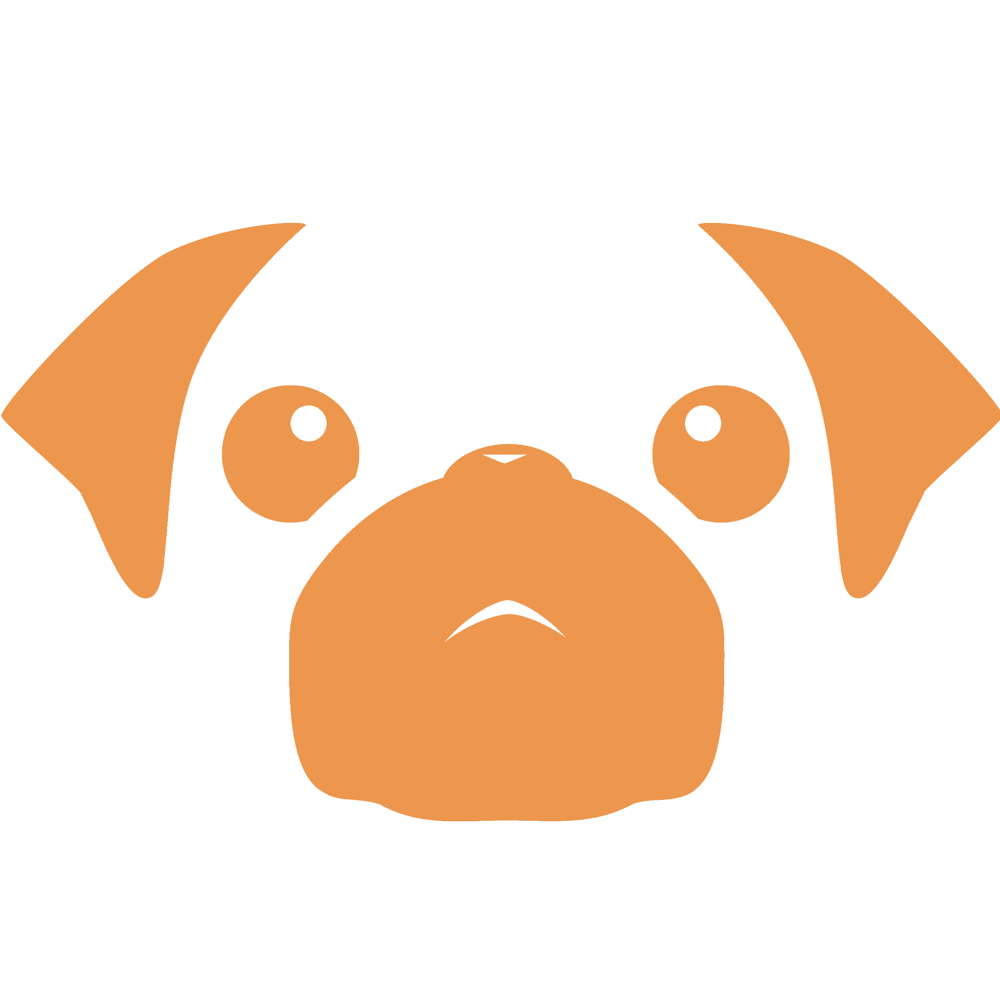

# RGL.gg PUG Crash Course

Updated 5-15-2020

[Introduction](#introduction)

- [Prolander](#prolander)

- [No Restriction 6s](#no-restriction-6s)

[Communication](#communication)

[Maps](#maps)

- [Payload](#payload)

- [King Of The Hill](#king-of-the-hill)

- [5 Control Points](#5-control-points)

- [Attack-Defend](#attack-defend)

[Other Resources](#other-resources)

# Introduction

------------

RGL PUGs are Pick-up Games hosted regularly in the RGL official Discord.
The formats hosted are Prolander and No Restriction 6s. They are open to
players of all skill levels, and are balanced based on players’ skill
and experience. For how long an individual PUG should take, setting
aside an hour of time is suggested.

How to Join PUGs

Go to
[RGL.gg/pugs](https://www.google.com/url?q=https://rgl.gg/pugs&sa=D&ust=1590454678431000).
That will give you an invite link to the Discord. Once you’ve joined,
you need to go to the `#rules_and_setup` channel and read the Discord
rules, and follow the instructions for how to access the discord. Once
you have access to the discord, go the `#pugs` channel, and read the
information there, including the rules, and react with the role you’d
like.

- Pugs: this gives you access to the base of pugs
- Pugs Without Announcements: This gives you access to the base of
    pugs, but with no announcements. Please note you have to remove the
    pugs role mentioned above to stop receiving announcements
- Late Night Pugs: This gives you access to announcements for pugs
    after 12:00pm EST
- Experimental pugs: These are pugs where something is tested out,
    like different maps or a different config.

The two formats played in pugs are described below.

#### Prolander

[Prolander](https://www.google.com/url?q=https://rgl.gg/?r%3D1%26&sa=D&ust=1590454678432000) is a format that has a class limit of 1, but a player limit of 7. There’s a high emphasis on class flexibility, as you can switch classes as needed to respond to the situation. Prolander plays similarly to Highlander, but the games are often faster paced. Classes played depends on the team, but it’s common for there to be a steady combo and a flank, with some people flexing as necessary.

Prolander uses the RGL Prolander [whitelist](https://www.google.com/url?q=https://whitelist.tf/rgl_7v7_s8&sa=D&ust=1590454678432000), which restricts a small number of weapons from play considered overpowered or broken.

#### No Restriction 6s

[No Restriction 6s](https://www.google.com/url?q=https://rgl.gg/?r%3D37&sa=D&ust=1590454678432000) (NR6s) takes its inspiration from in-game competitive. This means you have six players on each team, but there are no class limits nor a weapon whitelist. The cosmetic [whitelist](https://www.google.com/url?q=https://whitelist.tf/rgl_nr6s_s3&sa=D&ust=1590454678433000) common to RGL is still used.

Because there are no class restrictions or weapon limits, how NR6s is
played depends highly on how the team decides to arrange themselves.
Switching classes rapidly also allows for people to do unique things
such as temporarily have a second engie to get buildings up quickly
during setup time, or being able to counter pick based on what the enemy
team is running.

The Process of Pugs

When pugs are announced you take the following steps to join the game

1. Join the voice channel “Pickup Waiting”. If spots are full, just
    keep an eye out for openings or a second pug.
    Once you’re in Pickup Waiting you are guaranteed a spot in the next
    pug. Be patient, as some games may take longer to finish. When the
    game is finished, you will be automatically moved to the “Building
    game” channel.
2. Once you’re in “Building Game”, wait while the teams are sorted by
    an automatic system and the runner adds anyone not currently part of
    that system.
    If you have never played before you will be asked for your RGL
    profile. If you don’t have one, simply go to RGL.gg and sign in
    through steam.
3. Once teams are ready, you will be automatically sorted into either
    the Red or Blu team channel. You will receive connect info for the
    server from a Discord bot.
4. Once in teams you should discuss your classes, and what you want to
    do as a team, then Ready Up.
5. Once the pug is over, you will be moved back into ”Building Game”.
    If you have to leave, now is the time to do so. If you want to stay
    for the next pug stay put. New players from pickup waiting will be
    pulled in, and if there’s too many people for one pug, some people
    will be randomly chosen to be moved back to pickup waiting.

* * * * *

Notes

- Please tell the pug runner right away if you have any issues with
    the pug.
- “Sitting Out for a Round” is an AFK channel, and going in there will
    not get you in a pug.
- If you are connected on a mobile device in pickup waiting, and you
    get moved, Discord will disconnect. As such, mobile Discord is not
    compatible with pugs until a patch is issued for this.
- While you can be deafened in pickup waiting, you need to be
    undeafened in “Building Game”, or you may be assumed to be AFK.
- Please do not move yourself from building game to pickup waiting at
    the end of the pug. It will skip the queueing system.
- Experimental pugs (EXP PUGs) are pugs for testing new maps or
    changes to the config. With these pugs it’s important to keep in
    mind that setting them up will take longer, and will frequently be
    asked to provide feedback. While playing these pugs think about what
    does and doesn’t work.
- Experimental PUGs are hosted as needed, so by their nature they will
    be infrequent. When maps are being tested download links will be
    supplied. It’s important to read the announcement for exp pugs, as
    it will have all the details of what’s going on.

# Communication
-------------

Communication with your teammates in pugs is absolutely vital. Before
the pug starts it’s important to discuss what class everyone is playing,
and making sure people are comfortable with the classes they’ve chosen.

When the pug starts, relaying important information to your team is
important. Think about things your team might want to know, but
doesn’t.

Your setup

Consider a push-to talk option to easily filter what you’re saying, or
to spare teammates from background noise. On Discord, it is found under
Settings → Voice and Video → Input mode.  You can also adjust your
output volume here.

Damage Callouts and Focus Fire

The consensus among players is to round to ten on damage calls, trading
off what is likely unnecessary precision to be faster and with lower
chance of misinterpretation.  At higher levels, more precise numbers
might prove appropriate. Sometimes line of sight may prevent you from
giving actual [damage numbers](https://www.google.com/url?q=https://www.youtube.com/watch?v%3DVQoOqN32Vw0&sa=D&ust=1590454678436000) anyway, but they are always more useful than “hurt” or “rolled” if you know them.

If a target takes a lot of damage or is in a dangerous spot, the call
might go out to focus them in hopes of securing a kill. Focuses are also
excellent for quickly cleaning up teamfights.

Deaths

Opponents’ deaths are exploitable. tf\_use\_match\_hud, which is enabled
by default, shows this information at the top of your screen, but it
never hurts to mention it out loud.

-   No Scout: the enemy team struggles to cleanup kills and manage flank
-   No Soldier: easy to push flank, relieves players of the necessity to
    watch skies for a bomb
-   No Pyro: enemy team is more vulnerable to spam, and cannot disrupt
    ubered players with airblast.
-   No Heavy: enemy will struggle to punish over-extenders and deny
    bombers.
-   No Demo: easier to push in and secure locations, or rush chokes.
-   No Engie: easy to destroy his supportive buildings. On payload
    defense, an engineer pick and the subsequent destruction of his
    buildings means the defenders have to consider giving up a point.
-   No Sniper: much more of the map is free to move around in, your own
    sniper can operate uncontested
-   No Medic: damage is permanent. Couple this with the fact that your
    team will likely now have Uber advantage, you should try to drag the
    fight out, abusing your heals and being very careful with your own
    medic to retain Uber adv
-   No Spy: enemy team cannot gather intel, and you can refrain from
    checking your back constantly.

Similarly, if you go down, let your team know so they can play
accordingly. \
Ex: “Your scout died. You have no flank right now, so soldier might try
something”.

Ubers

Uber is the most powerful ability in the game, and it dictates the tempo
of every fight and every match.

Uber is easily expressed in terms of advantage. If they have 20% and you
have 80%, you have 60% points of advantage, “60 ad”. The other team has
Uber “disadvantage”.

Experienced medic players like to estimate the enemy medic’s Uber based
on when he spawns and calculate ad, keeping in mind that the fastest an
Uber can be built up is 40 seconds. Spy can also tell his team the exact
percentage of the enemy charge. Be sure to remember this when playing
either class.

Enemies and their Locations

It is good that everyone knows where the enemy team is and what they are
up to.

There are about four ways to do this.

Using a specific name for a specific location. A list of very common
“Map Callouts” can be found in the map section below. You have to
distinguish between the Red and Blu sides on symmetrical KotH maps--I’d
recommend saying “ours” and “theirs” rather than the colors themselves.

You can also call position relative to ear objects on the map with a
definitive name. This would be gameplay objects, such as health and ammo
packs, the payload cart, the tracks it moves on, control points, and
teams’ spawn rooms.

A general direction or quadrant. “Sniper top left” meaning that the
sniper is on high ground somewhere on the left side of the map. Left and
right can only be relative to your spawn rooms, so if a player is behind
the enemy team, this can be very confusing.

Finally, players relative to other players with a known location. For
example, you could tell your team that the enemy heavy is guarding their
sniper, or that there’s a soldier about to kill our medic and would
someone please do something about it.

Spy

Because of spies’ disguises and the speed at which you must react to him
to avoid someone getting stabbed, Spy is a special case. The generally
accepted format is “Spy [His disguise] [His location or target]”. Ex:
“Spy Scout on our medic”.

Your location

If you want to meet up with your team or receive arrow heals from your
medic, it might be useful to communicate where you are on the map.

More advanced plans

Finally, you can form plans with your team for upcoming engagements.
Unfortunately, the topic is too complex to cover here and would probably
verge on an actual strategy guide. Use downtime between fights to figure
out how to best take the next one, but don’t be afraid to abandon a
plan, because things can change for better or worse very rapidly.

However, the faster a team tries to switch tactics, the harder it is to
keep everyone on board. This is doubly true in a pug environment.

As long as everyone has a general idea of what everyone else is
currently doing (ie attacking, retreating), even subpar plays can turn
into gold. Keep it simple.

Finals words

Remember to be kind and have fun. Your teammates are people too, and you
are all learning together.

# Maps

----

Diagrams of maps played in RGL pugs, linked to Imgur albums to avoid
cluttering up the document. Remember to check the Imgur description for
additional details.

Still in the works!
If you want to help make these, or correct a mistake, join the server
[here.](https://www.google.com/url?q=https://discord.gg/atjXF8w&sa=D&ust=1590454678440000)

Download all nonstandard
maps [here](https://www.google.com/url?q=https://drive.google.com/file/d/1oVR6TumiOAGi7RpWucZ15_JbvN3oLbTL/view?usp%3Dsharing&sa=D&ust=1590454678441000).

#### Payload

-   [Upward](https://www.google.com/url?q=https://imgur.com/a/ceZst3T&sa=D&ust=1590454678441000)
-   Swiftwater
-   [Vigil](https://www.google.com/url?q=https://imgur.com/a/LvkbmmF&sa=D&ust=1590454678441000)
-   Borneo
-   Badwater Pro
-   Barnblitz Pro

#### King Of The Hill

-   [Product (Pro
    Viaduct)](https://www.google.com/url?q=https://imgur.com/a/AiCwwqn&sa=D&ust=1590454678442000)
-   [Lakeside](https://www.google.com/url?q=https://imgur.com/a/dHC41ar&sa=D&ust=1590454678442000)
-   Cascade
-   [Ashville](https://www.google.com/url?q=https://imgur.com/a/IejucHC&sa=D&ust=1590454678442000)
-   Coalplant (Very similar to Ashville)
-   Synthetic

#### 5 Control Points

-   Granary Pro
-   Snakewater
-   Sunshine
-   Metalworks
-   Process
-   Villa
-   Gullywash

#### Attack-Defend

-   Steel (Not currently played in regular PUGs)\

# Other Resources
---------------

Resources

[comp.tf](https://www.google.com/url?q=http://comp.tf/wiki/Main_Page&sa=D&ust=1590454678444000) -  Wiki style resource for all things competitive

[Engineer.tf](https://www.google.com/url?q=http://engineer.tf/&sa=D&ust=1590454678444000) - Map reviews, mentoring, and discussion for the engineer class

Tools

[logs.tf](https://www.google.com/url?q=http://logs.tf&sa=D&ust=1590454678445000) - This plugin uploads stats automatically, and can be viewed after playing

[Teamtrack](https://www.google.com/url?q=https://teamtrack.azurewebsites.net/%23/home&sa=D&ust=1590454678445000) - Tracks stats by team

Youtube Channels

[Mr. Slin’s Youtube](https://www.google.com/url?q=https://www.youtube.com/channel/UCd2ou70BQcHDLnlJ_qnLslw&sa=D&ust=1590454678446000)

Organizations

[Newbie Mixes](https://www.google.com/url?q=https://steamcommunity.com/groups/na6v6newbiemix&sa=D&ust=1590454678447000) - An introduction to 6v6 competitive.

[TF2Center](https://www.google.com/url?q=https://tf2center.com/&sa=D&ust=1590454678447000) - A place to play TF2 games based on specific competitive game-modes.

